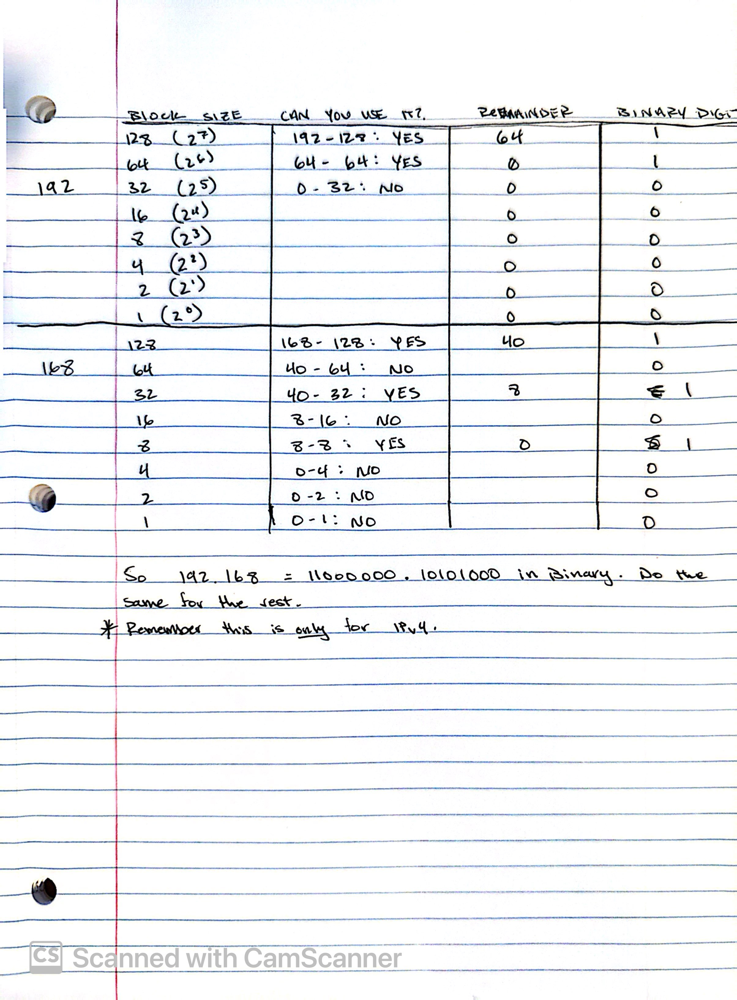

# IP Addressing and Subnetting

IPv4 addresses occupy a range from 0.0.0.0 to 255.255.255.255
There are 32 bits total in these IP addresses with each octet (seperated by a .) representing 8 bits.

Since there are only 2 possible values in Binary, 1 & 0, and 32 bits total in an IP address, this means 2^32 = 4,294,967,296 is the total number of available IP addresses in the IPv4 address space.

## Powers of 2 Method for Decimal -> Binary Conversion
 ### 192.168.1.1 (Example IP)

 To convert the above the IP address to Binary, you would start with the first octet which is 192.
 
 1. Start with the largest power of 2 that is equal to or less than your number, in this case 192, and work your way down.

 2. Starting with 192 from the address above, what power of 2 is the largest power that is equal to or less than 192? The answer is 2^7 = 128. You cant use 2^8 because that equals 256 which we cannot use since the address space only goes to 255. 

 3. Subtract your largest power of 2 value (128) from your IP octet value, 192. 192 - 128 = 64 = Binary Digit of 1.

 4. Using this method, go down the octet list and subtract the highest power of 2 from the REMAINDER each time and determine the binary digit. If you CAN subtract from it without getting a negative number, designate the binary digit 1, if you CANNOT, binary digit = 0.

# Subnetting
 Subnetting is the process of dividing or breaking a larger network down into smaller networks. This is good for security and efficiency.

 ## CIDR - Classless Inter-Domain Routing

 - Defines a way of expressing the size of a network by use of prefixes. (/16, /20, /25, etc)
 - The prefix determines which portion of the octet bits are used for the network portion of the IP address and the rest are used to denote the host portion (devices)

Example: /16 = First 16 bits (192.67.0.0/16) are used for the network portion so that would be the 192.67

- Larger prefix = Smaller network

By general rule of thumb, if you were to increase the value of the prefix by 1, lets use /16 -> /17, that would mean that one /16 network is equal to 2 x /17 networks.

# Converting Binary to Decimal

Use the position table to convert both ways! Decimal <-> Binary

| Position| 1 | 2 | 3 | 4 | 5 | 6 | 7 | 8 |
| Binary Position Value | 128 | 64 | 32 | 16 | 8 | 4 | 2 | 1 |
| Binary Digit | use this field when converting decimal to binary

Take the example of 133.33.33.7

Starting from left to right:

- Compare decimal number (133) to Binary Position Value from above table. If the decimal number is SMALLER, write 0 in the Binary Digit and move on to the next binary position value.

- If decimal number is EQUAL OR LARGER than the binary position value, write a 1 in the Binary Digit and subtract your binary position value from your decimal number which is the remainder you will use for the rest of the steps.

- Rinse and repeat for the remaining values. 

To convert Binary to Decimal, 

Where ever there is a 1, determine the binary position value of that 1 and write the number in place of the 1 then add them all together to get the Decimal number. 

for example, 133 in Binary is 10000101

Using the table above, we can see that there are three 1's in this binary number. they are at the 128, 4, and 1 positions. 128 + 4 + 1 = 133 = Decimal Number.