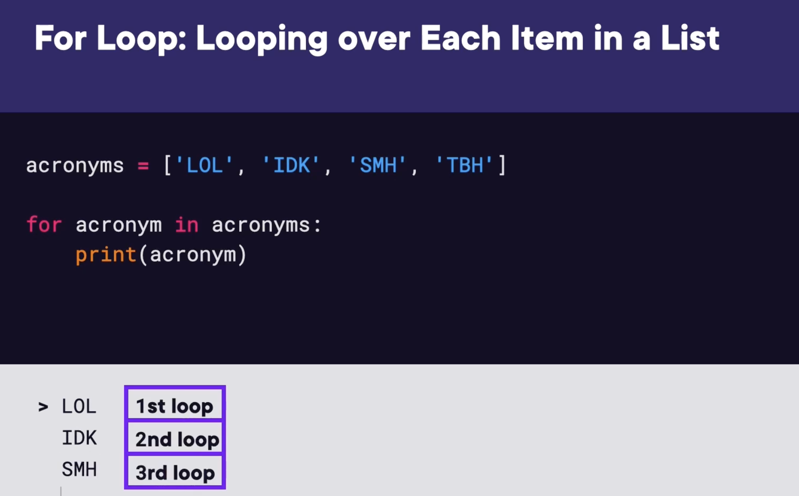

## List/List's in Python

A "list" in python is a container that can store anything (data) in a specific order.

- A list is represented by the [ ] brackets. Nothing inside the brackets means it is an empty list.

- ['hello', 'goodbye', good evening'] = a list of strings

- [1, 2, 3 , 4] = a list of numbers

- [1, 'hello', 2, 'goodbye'] = mixed list.

- [1, 2, 3], ['A', 'B', 'C'] = List of lists.

In a list, pay attention to the order of the data items within the brackets as they are represented by position numbers. For example, in the string list above, 'hello' is at position 0, 'goodbye' is at position 1, 'good evening' is at position 2, and so on. The list positions always start at 0!

### Creating a list and adding items.

Start with an empty list in the example below:

- acronyms = [ ]
- you can add items using the .append method.

acronyms.append('LOL')

acronyms.append('TBH')

acronyms.append('SMH')

But what is a method? - Methods differ from functions in that they are called on an object. Print is a function while .append is a method. To use them, first type the name of the list you want to change, then .append (or any other method), then what you want to add to the list in parenthesis.

- .remove is a method you can use to remove an item from a list. It is set up the same way as the .append method. : acronyms.remove('LOL')

- if you dont know the value of what you want to remove but you do know its position in the index, you can use del (short for delete) to remove an item from the list. del acronyms[2] for example would delete the 'good evening' string from the acronyms list.

### Check a list to verify if a value is present

^ The list was defined as well as the value of the variable 'word'. Using an ***if*** statement followed by the item you are looking for, followed by the ***in*** statement, followed by the list name, then print the above.

### The Syntax of A ***for*** Loop

What is we want to print each acronym on a seperate line? Instead of back to back with commas inside the brackets?

A loop would allow us to do this. We can use the ***for*** statement.

**Notice** how the print statement is indented, that is because it is the code block we want to be repeated inside the loop just like an ***if*** statement.

