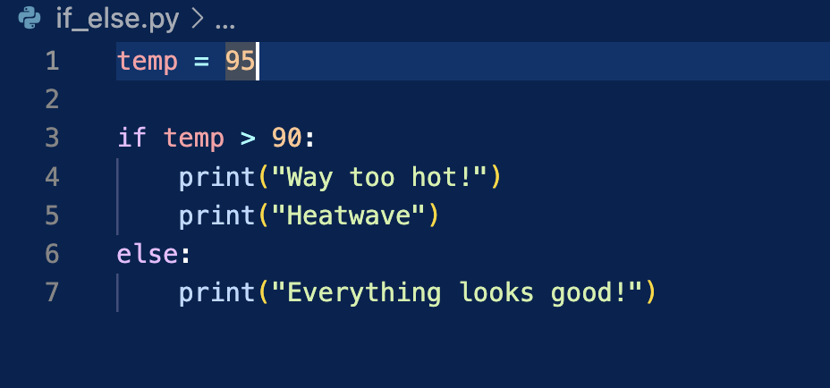

# 6 Comparetors of Python:

- < or 'less than'
- <= or 'less than or equal to'
- == or 'equal'
-  ">=" or 'greater than or equal to'
- ">" or 'greater than'
- != or 'not equal'

Using the above "comparators" is like asking a question: for example

temp = 95 is assigning 95 to the 'temp' variable

temp == 95 is asking if the temp is equal to 95?

temp < 90 is like asking if the temp is less than 90

### An ***if*** Statement -
Lets us ***decide*** what to do: ***if*** True, then ***do*** this.

## How decisions are made in Programming, more specifically Python,

A conditional statement or an 'if' statement lets us make decisions in Python.

In times when the ***if*** statement returns false, we can use an ***else*** statement to display something in the event that its false.

## Indentation

Indentation is extremely important in Python. When looking at ***if*** and ***else*** statement or anything else really, you have to make sure your indentation is correct.

 - We have a variable we assigned the integer 95 to. 
 - we have an ***if*** statement that says 'if temp is greater than 90 then print 'way too hot!' and 'heatwave', or else print 'Everything looks good!'
 - Since the temp variable is 95 in the example above, the if statement is labeled as true and will print the first set of comments.

 - Also make note of the indentation: after the ***if*** statement, you see the print statements indented a bit forward. This is because those are a part of the ***if*** statement's code block and everything within it if used. For the ***else*** statement, we see it has to start at a new line in line with the if statement.
 - Do not forget the  (:) at the end of the if and else statements.

 ### An ***elif*** statement

 - When you combine and ***else*** and ***if*** statement, you get an ***elif*** statement.

 - Gives another option for the response to be true and something else to print. 
    
    ***elif*** temp < 75:
        print("Its too cold)

## Logical Operators and Booleans

The logical operator ***or*** lets you combine multiple comparisons (like if and elif)

- At least one of the ***if*** (or ***elif***) statements need to be true for the whole ***if*** statement to be true.

The logical operator ***and*** also allows you to combine multiple comparisons.
- both statements need to be True for the ***if*** statement to be True.

Logical Operator ***not*** lets you negate a comparison and can help make the statement more readable.