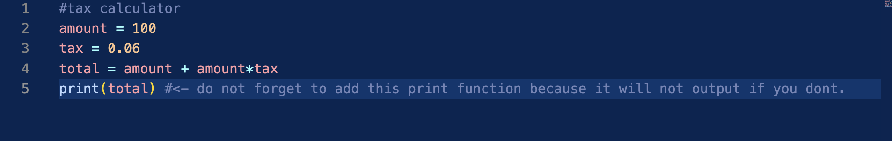
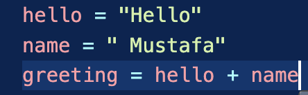
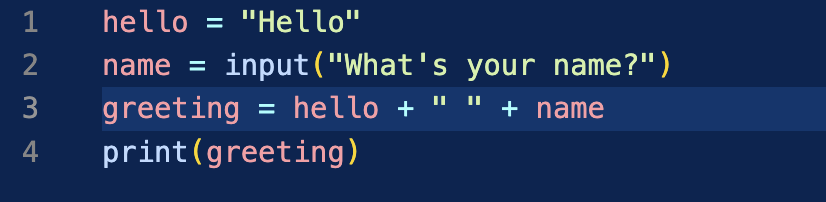

# Introducing Data Types

### Integers (int)
A variable with a **whole** number assigned to it
1) Variables: these are assigned by attaching the = sign to a word. Anything with an equal sign is a variable. 
    - For Example: length = 10, with "length" being the variable.
    - if you were to make other variables, such as "width", you could use operators like *, +, -, etc to get a mathematical solution by simply attaching variables.
    - Example: length = 10, width = 10,
        area = length * width
        area = 100.
    - Most of the arithmetic operators in Python are the same as you would see in a calculator. (+, -, /, *)

### Float
Essentially the same thing as above but instead of a whole number, the variable contains a **decimal**.

# DEMO: TAX CALCULATOR

There are 3 variables in this script. 'amount', 'tax', and 'total'.

-------------------------------------------------------

### Strings

Anything inside of single or double quotes is considered text and is called a "String".

 - name = 'Mustafa'
   print(name)

Use double quotes if the text inside the string itself has single quotes to avoid errors. For example:

    - name = "Mustafa's Store"
      do not use name = 'Mustafa's Store' as there is three single quotes that will error out on the terminal.

What if we want to concatenate (join together) two strings?
    - We can use the + operator to concatenate two strings.

What is missing from the above? (hint: it wont show in the output as it is currently written, and it also will output it as HelloMustafa)

- You need to add the 'print' function in order to print it.
- You need to add a "" between the two variables so that python recognizes there is a space and will print it as Hello Mustafa instead of HelloMustafa.

### Input Function

The input function is another built in function (like print). The term 'input' is referring to what the user will *input* back to the program after the script is ran. 

After the above script is ran successfully, the terminal will first print the greeting variable which is
    
- You will notice that in the terminal, when it asks for your name, and you **input** your response, there is no space between "What's your name?" and where you type. This can be remedied by adding '\n' to end of your input before the final quotation.
    - (What's your name?\n)
    - \n is a special character for a new line.

### Boolean

Can store either a ***True*** or ***False*** value.